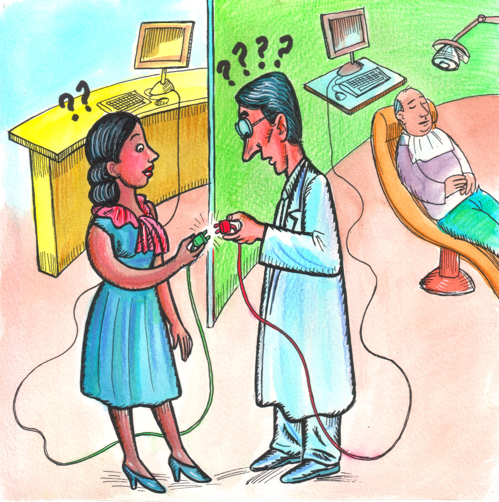

# Software interoperability for Orthodontics

## Scope/Mission

Our mission is to bring real interoperability to the people in the orthodontic domain.

## A Problem

As of 2021, it is astoundingly still very difficult to set up two or more orthodontic software products to communicate with each other. Most software products are unable to communicate effectively and openly with other software products from other vendors, creating closed, isolated silos of data. This causes trivial everyday tasks to be unnecessarily time consuming, repetitive, error-prone and tedious.

## Another Problem

As of 2021, it is also astoundingly very difficult to share information between different medical institutions. Several portals exist, however most (all?) of them work with a limited set of institutions, and these portals don't communicate with each other.

Let's compare this for a moment with how email works: with email any company can set up their email servers and exchange email with any end user and any other company's email server.

Why can't we do the same for orthodontic data?

## Solution

We believe informatics standards like DICOM, HL7 and SNOMED/SNODENT to be an effective solution to orthodontic software isolation. Permanent changes can happen in a community when the vast majority of the community members are on board and willing to make the change. Our plan to turn this into a reality includes:

### Strategic Plan

- Facilitate adoption of standards through education and simplification.
- Aim efforts to all actors of the orthodontic community (doctors, associations, standard developing organizations, IT teams, schools, students).

<!-- TODO: Add graphical representation of timeline

- 2021-Q2 Implementation of VNA on beta practices
- 2021-Q3
- 2021-Q4
- 2022-Q1 Development and implementation of efficiency measurement system
- 2022-Q2 Development of Standards for Photography (DICOM, SNODENT)
- 2022-Q3 Implementation of Photographic standards (open-source, github)
- 2022-Q4 Development and implementation of first photographic archiving application: DICOM ortho-photo-archiver
- 2023-Q1 Comparison of efficiency between pre and post DICOM ortho-photo-archiver: publication of findings.
- Development and implementation of first photographic acquisition application: DICOM ortho-photo acquirer
- Development of Standards for 2D Radiographs (cephalograms/panoramic x-rays) (DICOM, SNODENT, IHE, ...)
- Development of tools to convert flat cephalograms into DICOM and store in VNA: DICOM ortho-ceph-archiver
- 2023-Q2 First orthodontic interoperability booth at AAO
- 2023-Q3
- 2023-Q4
- 2024-Q1
- 2024-Q2
- 2024-Q3
- 2024-Q4
- 2025-Q2 First orthodontic Connectathon at AAO

-->

<!-- ## Values

TODO: Add Values. -->

## Our Vision

We envision a world where

- the orthodontic provider can pick and choose whatever software suits their need to accomplish whatever task they need to accomplish without having to worry about data conversion, importing or bridging.
- the orthodontic software developer can easily bridge with other systems by implement open standards without requiring private consultants or long hours for understanding standard documentation.
- both the orthodontic software developer and the orthodontic provider don't need keep spending time and resources for data conversion or custom integrations.
- Small-scoped software products can enter the private practice of the orthodontic-provider seamlessly.

## Our Projects

- [#open-ortho:matrix.org](https://matrix.to/#/#open-ortho:matrix.org): Official chat-room.
- [panio.info](https://confluence.panio.info): Our Confluence wiki collaboration platform.
- [ortho-tank](https://github.com/open-ortho/ortho-tank): Documentation and scripts to simplify the installation and maintenance of an Orthanc based PACS Imaging Server for the orthodontic practice.
- [dicom4ortho](https://github.com/open-ortho/dicom4ortho): A Python library to create fully defined orthodontic photographs in DICOM.
- [dcm4ceph](https://github.com/open-ortho/dcm4ceph): Convert Cephalograms from JPEG to DICOM. Cephalograms are 2D radiographs of the cranium, taken by following standards which allow providers to take measurements and make clinical decisions from them.

- [Slides of Introductory Presentation](https://open-ortho.github.io/ACT-12.4.1)
- [Orthodontic Photos Video Presentation](https://youtu.be/7fZIQxOjb6c): a video we produced to apply for the American Association of Orthodontics Innovators Award.

<!-- ## Resources

TODO: add Resources -->

<!-- ## Who we are

TODO: Add list of who we are. -->
